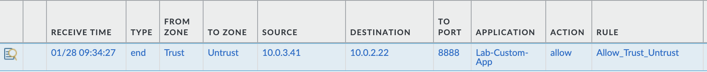

# Security Profiles
1. To begin configuring profiles, go to Objects → Security Profiles
2. To easily edit profiles based on best practices, clone the best-practice versions (like strict) so you can tweak them later without breaking the defaults
3. Clone best practices for Antivirus, Vulnerability Protection, Anti-Spyware, URL Filtering
4. Create a Profile Group in Objects → Security Profile Groups, and add the profiles you created
5. Apply to policies under the Actions tab
# EDL
1. Visit https://opendbl.net/
2. Click the Padlock icon → Connection is secure → Certificate is valid
3. Look for the E8 (intermediate) certificate
4. I downloaded the root certificate ISRG Root X2 from https://letsencrypt.org/certificates/
5. Import it into SCM under Manage → Configuration → Objects → Certificates
6. Create a Certificate Profile under Objects → Certificate Profile
7. Define the External Dynamic List under Objects → External Dynamic Lists
	Name: IPSum_Level3_Feed
	Type: IP List
	Source: https://opendbl.net/lists/ipsum-level3.list
	Certificate Profile: Select EDL-Trust-Profile.
	Repeat: Hourly
8. Create a policy to block the malicious IPs
9. Verify in the firewall (giving time for the list to populate)

# App-Override
1. Phase 1: Creating the App
	- Go to Objects → Applications and click Add
	- Name: Lab-Custom-App
	- Category / Subcategory: set to whatever, it doesn't really matter
	- Advanced Tab: In the Port section, add tcp/8888
2. The Override Policy
	- Navigate to Policies → Application Override and click Add
	- General: Name it Override-Port-8888
	- Source/Destination: Add your Trust zone
	- Protocol/Application Tab:
		- Protocol: TCP
		- Port: 8888
		- Application: Select your Lab-Custom-App
3. The Security Policy: I already had a policy that would allow this but verify
4. Testing with the CLI:
	- On my server I ran `timeout 1 bash -c 'cat < /dev/null > /dev/tcp/10.0.2.22/8888'`
	- Now check Monitor → Traffic Logs. If you see Lab-Override-App in the application column, you’ve successfully bypassed App-ID!

# IoT
1. Activating in SCM
	- Navigate to Insights → Device Security
	- SCM will ask you to activate the tenant if its your first time
2. Wait for the data: It usually takes about 15-30 minutes of active traffic before devices start popping up in the inventory
3. Once the logs start hitting the Strata Logging Service (SLS), head over to the Inventory page

