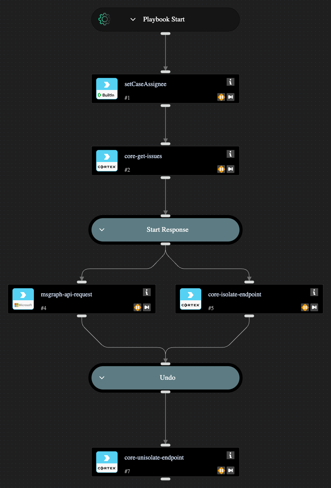
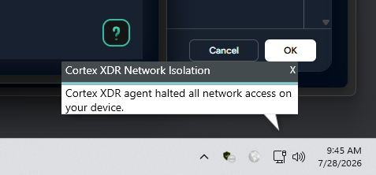
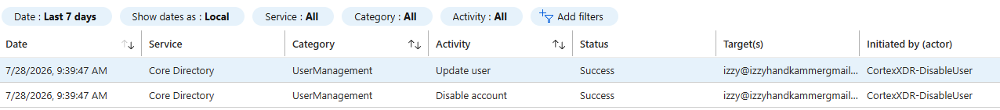

# Entra ID Setup
- Went to the [Entra ID pricing page](https://www.microsoft.com/en-us/security/business/microsoft-entra-pricing) and grabbed the free account at the bottom under Entra ID Free. Used a personal email.
- Logged into Azure and navigated to Microsoft Entra ID
- Created the default directory and grabbed the Tenant ID off the Overview page
- Logged into CIE, went to Directories
- Add New Directory > Cloud Directory > Set Up > Entra ID
- Pasted in the Tenant ID, selected the CIE Enterprise App connection flow, hit Generate URL
- Left the default data collection permissions on (user risk, roles/admins, enterprise apps, device info)
- Opened the generated URL, signed into the Entra Global Admin account, clicked Accept
- Back in CIE, hit Test Connection - came back connected
- Named the directory and hit Submit
- Checked Directories again - Entra ID showed up with sync status Success and users/devices/groups populated
Tenant ID and domain redacted here, swap in your own.

# Cortex XDR Playbook - Isolate Endpoint

Built a playbook that triggers on malware detection, isolates the box, and disables the compromised user's Entra ID account.

## How it flows
 
1. `setCaseAssignee` - assigns the case to me
2. `core-get-issues` - pulls the issue details (hostname, endpoint ID, etc.) so the rest of the playbook has something to work with
3. Start Response - manual title/checkpoint step, requires confirmation before it moves forward. Displays the hostname so you know what you're isolating.
4. Splits into two tasks that run in parallel:
   - `msgraph-api-request` - PATCH to `/users/{user}` with `accountEnabled: false` to disable the Entra ID account
   - `core-isolate-endpoint` - isolates the endpoint using its ID from the issue
5. Undo - another manual checkpoint if you need to reverse it
6. `core-unisolate-endpoint` - brings the machine back online using the endpoint ID from the isolation step
Both the isolate/disable step and the undo step require manual confirmation, nothing fires automatically without a human clicking through.
 
User/email fields in the exported yml redacted, replace with your own tenant's values.

