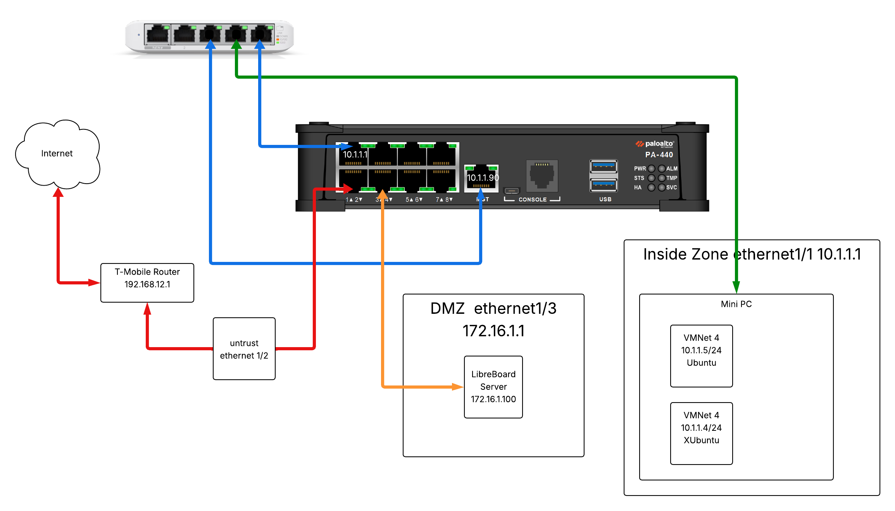

# Home Lab Deliverables: KSO Project Documentation
This document serves as the guide, chronicling the design, configuration, and implementation of my personal security home lab. The entire environment is anchored on a Minisforum UM890 mini PC running a virtualization platform.

The core objective of this project was to successfully fulfill the KSO Lab Deliverables by establishing a functional, segmented, and secure network environment demonstrating key Next-Generation Firewall (NGFW) and routing concepts.

## Key Deliverables:
These are the required milestones I set out to achieve with this home lab:
* The deployment of multiple client and server virtual machines.
* The establishment of L2/L3 connectivity with VLANs and OSPF dynamic routing.
* The configuration of fundamental security policies utilizing Palo Alto Networks' App-ID and Content-ID features.
* The onboarding of the PA-VM to a centralized Panorama management server.
* The implementation of a security policy based on User-ID to demonstrate identity-aware access control.

## Ordered Table of Contents
| # | Document                                                          | Status      | Coverage                                                                                 |
|---|-------------------------------------------------------------------|-------------|------------------------------------------------------------------------------------------|
| 1 | [PA-440 Setup](PA440_Setup.md)                                    | Complete    | Initial firewall setup, MGT access, and base system configuration.                       |
| 2 | [Network Segmentation and Zone Deployment](Segmentation_Zones.md) | Complete    | Layer 3 interfaces, Security Zones, OSPF setup, NAT, and basic internet security policy. |
| 3 | [VM Deployment](VM_Deployment.md)                                 | Complete    | Documentation of client configuration and connectivity.                                  |
| 4 | [App-ID and Content-ID Security](AppId_ContentId.md)              | Complete    | Refining the security policy using NGFW features.                                        |
| 5 | [LibreBoard Server Setup](LibreBoard_DMZ.md)                      | Complete    | Creation and configuration of DMZ server.                                                |
| 6 | [Onboarding Panorama](Panorama_Onboarding.md)                     | Complete    | Deploying the Panorama VM and connecting the PA-440 for central management.              |
| 7 | [Enabling Decyrption](Decryption.md)                                            | Complete     | Configuring Decryption for visibility.                                               |

## Network Diagram

# To Do:
## Documentation & Setup Refinements:
## Pending Deliverables & Configuration:
